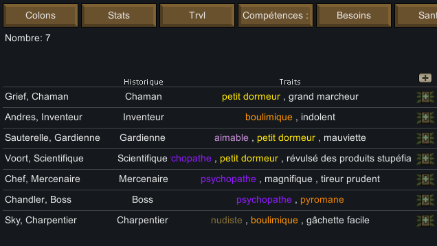

# Numbers Trait AddOn [Français]

Numbers Trait AddOn [Français] offre la traduction française du mod **Numbers Trait AddOn** pour le jeu RimWorld. Il permet avec le mod **Numbers** d'afficher une colonne visualisant les caractères des personnages du jeu avec des codes couleurs.

### Liens

Fichiers de traduction en français :
- [GitHub: Numbers Trait AddOn [Français]](https://github.com/b606/NumbersTraitAddOn-Francais/releases/latest)
- [Steam: Numbers Trait AddOn [Français]](https://steamcommunity.com/sharedfiles/filedetails/?id=2286691905)

